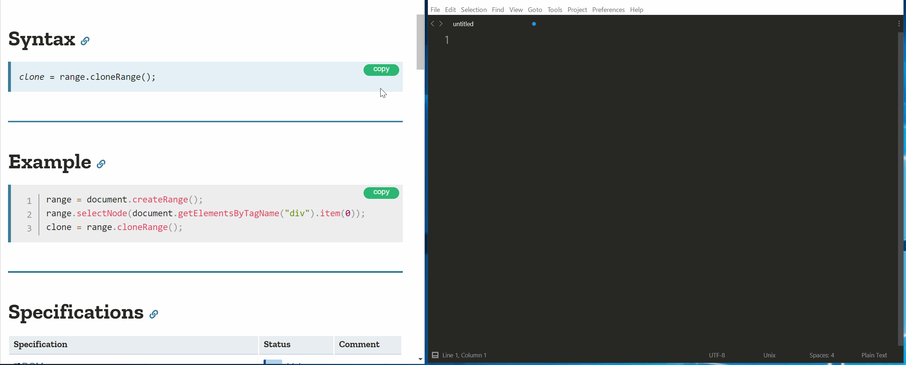

Webサイトのコードをコピーする拡張機能を作りました. 

`card:https://chrome.google.com/webstore/detail/quick-copy-snippet/lonpelnahhbcodeopbcjbopgfmkcfadm`

どんなものかは下のgifの通りです.

似たような拡張機能はすでにあったのですがほとんど丸々コピーするようなGistやGithubよりも 
GithubのReadme内のインストール手順やQiitaやはてなブログのワンライナー
で使いたかったので作りました.

変わりに(?)他の似たような拡張機能では可能なgithubやgistのソース丸コピーはできなくなっています. 
そういうやつはダウンロードしてください.(WIP)

ソースは以下のリポジトリの通りです.

`card:https://github.com/kokeshing/Quick-copy-snippet`

追加を考えている機能としてユーザーがCSSセレクタや無視するようにするサイトを
設定できるようにするのとReactのような仮想DOMで差分レンダリングされた場合は
Hookされないのでそれの対策を考えています.

