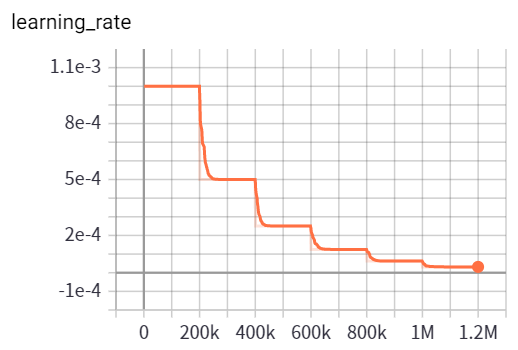
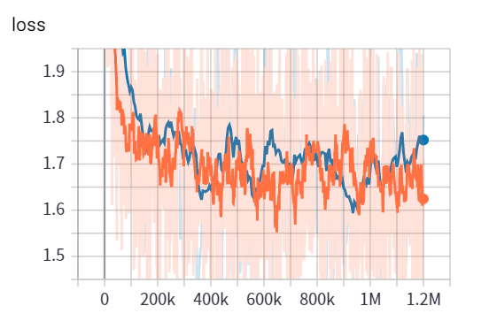

Wavenetの実装を公開しました.

`card:https://github.com/kokeshing/WaveNet-Estimator`


この記事では前の記事で説明していなかった実装した上で取り入れたこと,つまづいたことについて書こうと思います.

## 1.ソースの構造について

リポジトリの各ファイル,ディレクトリについて説明します.

### 1. /hparams.py

wavのサンプリングレートやモデルのinput_type,モデルの保存ディレクトリなど
必要なhparamsを設定しています.

### 2. /audio.py

wavファイルからデータを抽出する,wavファイルに書き出す,メルスペクトログラムを抽出する,など
音声ファイルや音声データに関わる関数を実装しています.
このファイルもhparams.pyの設定値を直接参照しないようにしています.


### 3. /preprocess.py

その名の通り前処理を行います.
audio.py内で実装した関数を用いてwavを前処理を施してからtfrecordに保存するようにしています.
hparams.pyの設定値を参照し,適切にaudio.pyの関数へ引数として渡しています.
tfrecordについてはまた後述します.

### 4. /dataset.py

preprocess.pyで作成したtfrecordを読み込んでパース,wavの入力長になるようランダムに切り出し,
マスクの取得などをしてモデルへと流し込むinput_fn, eval_fnを実装しています.
hparams.pyの設定値を直接参照します.

### 5. /wavenet/model.py  /wavenet/module.py

wavenetディレクトリはwavenetのモデルとモデルを組む際に使うパーツ群を定義しています.
model.pyでは

- tf.keras.modelを継承したWavenetモデル
- tf.estimatorでmodel\_fnとするwavenet\_fn

を実装しています.
model.py, module.pyともにhparams.pyを受け取るよう実装しています.(設定値を直接参照しない)
Wavenetモデルでは基本的にモデルの構築しか行わず,lossやoptimaizerはwavenet\_fn内で学習,検証,推論
のフェーズに応じて呼び出すメソッドを出し分けるようにしています.
入力データの整形などもwavenet\_fnで行っています.

### 6. /train.py

hparams.pyの設定値を参照しcustom estimatorを設定値を元に作成して学習をするファイルです.

### 7. /synthesize.py

hparams.pyの設定値を参照しcustom estimatorを設定値を元に作成して合成を行うファイルです.
メルスペクトログラムと保存先のパスを受け取ってwavファイルを保存する関数をhparamsで設定した
テストデータのディレクトリのwavファイルすべてに実行しています.

## 2. 用いた機能について

ここまで,ファイルの構造について書いてきました.
次は意識して実装した部分ついて書きます.

### 1. tf.estimatorを使う

今回,tf.estimatorを使ってモデルを組みました.tf.estimatorはTensorFlowの高レベルAPIで
学習や推論,モデルのexportなどが容易にできるように設計されています.
マルチGPUについてもtf.contrib.distribute.MirroredStrategyを用いることによって
モデル側のコードは一切変更せずにそのままマルチGPUで学習を行えます.


### 2. tf.dataを用いて学習・検証データの読み込みを行う

これはtf.estimatorの制約でもあるのですが
preprocess.pyとdataset.pyではtf.dataを用いることを念頭に置いた設計になっています.
公式が

`card:https://www.tensorflow.org/guide/datasets`

で説明されていますが,tf.dataはGPUでの計算中にCPUやメモリを読み込むなど
いい感じに入力前の値の加工,シャッフル,バッチサイズに切り出しなどを行ってくれます.
tf.estimatorでない通常のSessionを使うようなコードでも利用できるので是非利用してみてください.

### 3. 学習時もBTC(NHWC)の形式で実装する

これは趣味です. CUDAカーネルはBCT(BCHW)の形に最適化されているらしいので下手したら非効率です.
TensorFlowの標準がBTC(BHWC)だからとかそういう理由です.


以上の点を意識して実装しました.

## 3. はまったところ

いくつかはまったところがありましたので書いておきたいと思います.

### 1. tf.estimatorが勝手に入力テンソルのランクを1にする

tf.estimatorではinput_fnを(features, label)を返すと設計されており,たとえばfeaturesを

```python
    features = {x: [1, 128, 128], y: [16, 24]}
    return features, label
```

とした場合wavenet\_fnに入ってくるテンソルはflattenされた[batch\_size, 17223(128\*128+16\*24)]になってしまいます.
TensorFlowのソースを覗いたところ,features.keys()でforを回して
valueをすべて取得し一括にしているのでこういう動きになってしまうのかと思っています.
そこでかなり強引ですがdataset.pyでは

```python
    return {"x": {"x": inputs}, "c": {"c": mel_sp}, "mask": {"mask": mask}}, targets
```

とすることによってwavenet_fn内で

```python
    inputs = tf.feature_column.input_layer(features["x"], feature_columns[0])
    max_time_len = feature_columns[0].shape[0]
    mask = tf.feature_column.input_layer(features["mask"], feature_columns[1])
    c = tf.feature_column.input_layer(features["c"], feature_columns[2])
    num_mels = feature_columns[2].shape[0]
    max_time_frames = feature_columns[2].shape[1]
```

という感じで受け取ることによってwavとmel\_spが一緒にflatten()されて渡されてこない
ようにしています.(ただし各wavやmel\_spでflattenされているのでreshapeで元の形に戻す必要あり)

これについてはもっといい書き方をご存知でしたらぜひともご指摘お願いします.

### 2. Fast WaveNetで提案された一度畳み込んだ結果を保持するQueueをLayerで持っていると変数の関係上怒られる

はじめ, module.pyでのCasualConvでは

```python
    class CasualConv():
        def __init__(hoge):
            hoge

        def call(self, inputs, is_incremental=False):
            if is_incremental:
                enqueue = tf.concat([self.queue[:, 1:, :],
                                     tf.expand_dims(inputs[:, -1, :], axis=1)],
                                    axis=1)
                assign = self.queue.assign(enqueue)

                with tf.control_dependencies([assign]):
                    if self.dilation_rate > 1:
                        inputs_ = self.queue[:, 0::self.dilation_rate, :]
                    else:
                        inputs_ = self.queue

        def initialize(self, batch_size, residual_channels):
        with tf.variable_scope(self.scope) as scope:
            self.queue = tf.Variable(tf.zeros((batch_size,
                                               self.kw + (self.kw - 1) * (self.dilation_rate - 1),
                                               residual_channels),
                                              dtype=tf.float32),
                                     name="queue_{}".format(self.scope))
```

のようにしてqueueはCasualConvの各レイヤーのインスタンス側で初期化,保持するようにしていたのですが,
checkpointからrestoreする際,queueはcheckpointにない値なためエラーが起きてしまいます.
よって現在の実装のように外部にqueueを持ち,引数として受け取るように実装しました.

### 4. 学習,推論について

学習率とlossのグラフを貼っておきます.lossのグラフではオレンジがtrainで青がevalです.




P100では1GPUで1日200k程度,2GPUで1日300k程度でした.
lossは400kの時点で十分下がりきっているように見えるので1.2Mも回す必要はあまりないと思います.

batch_sizeや学習率もいろいろ試しましたがGANのようにハイパーパラメータに
そこまで敏感ではないように思えたのでWaveNetの学習はそんな難しくないと思います.

推論速度についてはP100で150step/secほどでした.22.5kHzの3秒程度の音声の合成に10分程度かかります.

最後に,実装や実装以外でも参考にしたリンクをまとめておきます.
大変参考になりました.ありがとうございます．

- [Wavenet](https://arxiv.org/abs/1609.03499)
- [Tactron-2](https://github.com/Rayhane-mamah/Tacotron-2)
- [r9y9/wavenet_vocoder](https://github.com/r9y9/wavenet_vocoder)
- [WN-based TTSやりました](https://r9y9.github.io/blog/2018/05/20/tacotron2/)
- [Synthesize Human Speech with WaveNet](https://chainer-colab-notebook.readthedocs.io/ja/latest/notebook/official_example/wavenet.html)
- [VQ-VAEの追試で得たWaveNetのノウハウをまとめてみた。](https://www.monthly-hack.com/entry/2018/02/23/203208)
- [複数話者WaveNetボコーダに関する調査](https://www.slideshare.net/t_koshikawa/wavenet-87105461)


この記事がこれからの実装の参考になれば幸いです.
